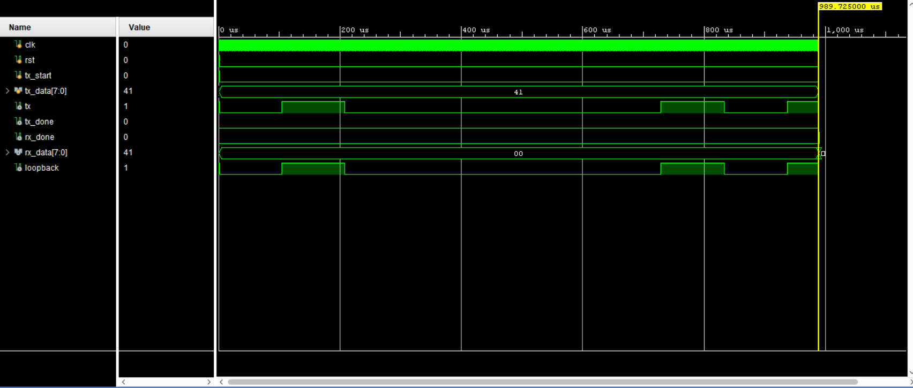

# Verilog UART Controller

A fully synthesizable UART (Universal Asynchronous Receiver-Transmitter) core implemented in Verilog HDL. This design features a 16x oversampling baud rate generator, an independent transmitter (TX) FSM, and a robust receiver (RX) FSM that samples data in the middle of bit intervals to filter line noise.

---

## 📐 Project Architecture

The design is split into an outer structural shell (`top.v`) that interconnects three independent sub-modules:

* **`baud_gen.v`**: Accepts a standard 100 MHz system clock and divides it down to generate timing "ticks" for 9600 Baud with 16x oversampling.
* **`uart_tx.v`**: A Finite State Machine that serializes an 8-bit parallel data packet into a standard UART frame (1 Start bit, 8 Data bits, 1 Stop bit).
* **`uart_rx.v`**: A Finite State Machine that samples incoming serial data at the midpoint of each bit frame to reconstruct the original 8-bit parallel byte.
* **`top.v`**: The structural top-level module connecting the baud generator, transmitter, and receiver.

---

## 🧪 Simulation & Verification

The design was verified using a local loopback testbench (`tb_uart.v`) in Xilinx Vivado (XSim engine). The testbench feeds a virtual 100 MHz clock, asserts a system reset, transmits the character `'A'` (`8'h41`), and verifies successful receipt.

### Functional Verification Results
* The simulation ran successfully for **2 ms** to allow the full 9600-baud frame to completely clear.
* The internal `tick` wire properly timed the transmission width at the precise bit interval (~104 microseconds per bit).
* The `rx_data[7:0]` register successfully latched the value `41` precisely when `rx_done` went high, matching the sent data flawlessly.

### Behavioral Simulation Waveform

